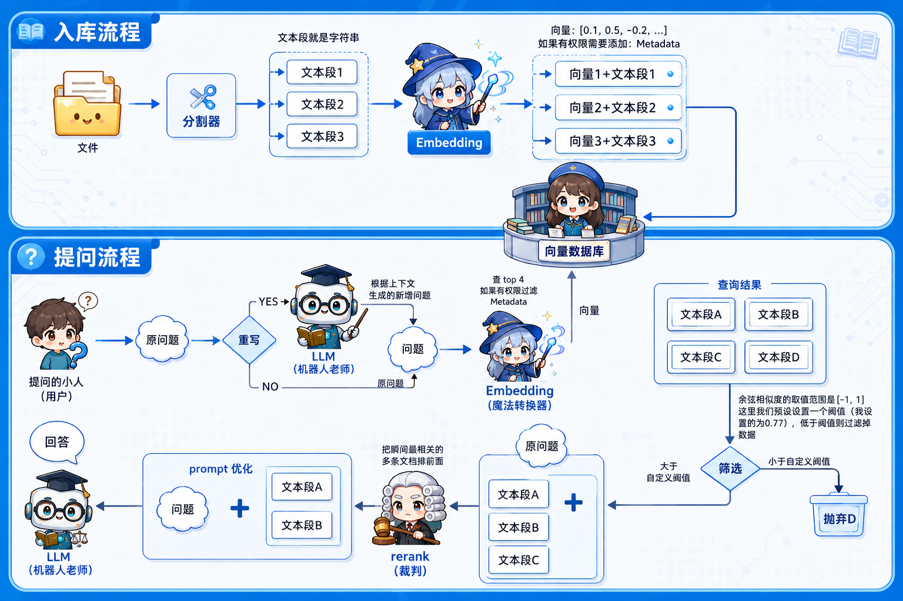
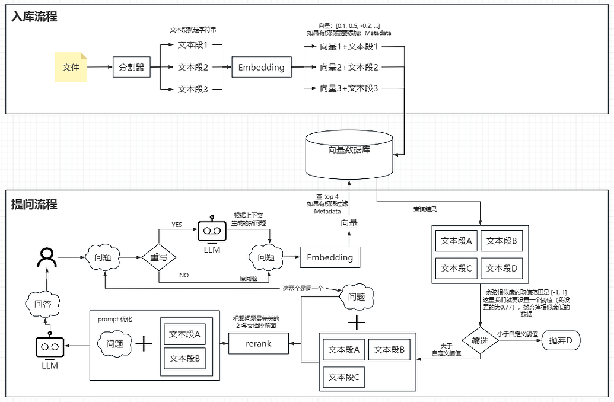

<p align="center">
  
</p>

<h1 align="center">RAG Study Helper</h1>

<p align="center">
  <strong>企业级 RAG（检索增强生成）问答系统</strong>
  <br>
  Spring Boot 2.6 · LangChain4j 0.35 · DeepSeek · 多源知识库 · 分布式限流
</p>

<p align="center">
  
  
  
  
  
</p>

> ⚠ **JDK 8 兼容说明：** LangChain4j 从 0.36.0 起要求 JDK 17，本项目使用最后支持 JDK 8 的 0.35.0。因此 Chroma 服务端锁定为 0.4.24（0.6.x+ API 不兼容），Milvus 使用 2.3.x。如需升级新版，需同时升级 JDK 17 + Spring Boot 3.x。

---

## 目录

- [系统架构](#系统架构)
- [快速开始](#快速开始)
- [LLM 配置](#llm-配置)
- [向量数据库](#向量数据库)
- [文档入库](#文档入库)
- [飞书知识库同步](#飞书知识库同步)
- [API 参考](#api-参考)
- [限流策略](#限流策略)
- [项目结构](#项目结构)
- [测试](#测试)
- [技术栈](#技术栈)

---

## 系统架构



```
┌──────────────────────────────────────────────────────────────┐
│                     Web UI (index.html)                       │
│     SSE 流式渲染 · Markdown 解析 · 会话管理 · 知识库面板       │
│     深色/亮色主题 · 移动端适配 · 消息复制 · 自定义提示框       │
└───────────────────────┬──────────────────────────────────────┘
                        │ POST /api/chat {sessionId, question}
                        ▼
┌──────────────────────────────────────────────────────────────┐
│                    RateLimitAspect (@RateLimit)               │
│        Redisson 令牌桶（IP + 全局每日）                       │
│        429 → 统一 Results 格式返回                            │
└───────────────────────┬──────────────────────────────────────┘
                        ▼
┌──────────────────────────────────────────────────────────────┐
│                      ChatController                           │
│            SseEmitter (60s timeout) · Jackson 序列化          │
└───────────────────────┬──────────────────────────────────────┘
                        ▼
┌──────────────────────────────────────────────────────────────┐
│                       RAG Pipeline                            │
│                                                               │
│  ┌──────────────┐   ┌───────────────┐   ┌─────────────────┐  │
│  │  会话历史      │──▶│  Query        │──▶│  Embedding      │  │
│  │  Redis        │   │  Rewriting    │   │  BGE-large-zh   │  │
│  └──────────────┘   └───────────────┘   └───────┬─────────┘  │
│                                                  ▼            │
│                                           ┌────────────┐     │
│                                           │ Vector      │     │
│                                           │ Store       │     │
│                                           │ top 20      │     │
│                                           └─────┬──────┘     │
│                                                  ▼            │
│  ┌──────────────┐   ┌───────────────┐   ┌─────────────────┐  │
│  │ LLM 回答      │◀──│ Prompt 组装    │◀──│ Rerank          │  │
│  │ DeepSeek /    │   │ 引用 + 约束   │   │ BGE-reranker   │  │
│  │ OpenAI 兼容   │   │              │   │ top 5          │  │
│  └──────────────┘   └───────────────┘   └─────────────────┘  │
│                                                               │
│  ┌───────────────────────────────────────────────────────┐    │
│  │ 文档来源                                               │   │
│  │  ├─ Web 上传（Multipart, SHA256 去重）                 │   │
│  │  ├─ 目录扫描（data/docs/ 自动扫描）                    │   │
│  │  └─ 飞书知识库同步（Feishu Wiki Sync）                 │   │
│  └───────────────┬───────────────────────────────────────┘    │
│                  │ 元数据                                     │
│                  ▼                                            │
│  ┌──────────────────────────────────────────────────────┐    │
│  │              MySQL + MyBatis-Plus                     │    │
│  │  documents（文档元数据） · document_chunks（分块映射） │   │
│  └──────────────────────────────────────────────────────┘    │
└──────────────────────────────────────────────────────────────┘

                         ┌────────────┐
                         │   Redis    │ ← 多实例共享会话 + 分布式限流
                         └────────────┘
```

---

## 快速开始

### 前置条件

- Docker（推荐）或 JDK 8+（本地运行）
- API Key：Chat 模型 + Embedding 模型的密钥

> 默认使用 DeepSeek 作为对话模型、SiliconFlow 作为 Embedding/Rerank 服务商。
> 可通过环境变量切换任意 OpenAI 兼容 API，参考 [LLM 配置](#llm-配置)。

### Docker Compose（推荐）

```bash
# 1. 复制环境变量模板并填入密钥
cp .env.example .env

# 2. 选择向量库并启动
#    InMemory（零外部依赖，重启数据丢失）
docker compose up -d
#    或 Chroma（持久化，中型项目）
docker compose -f docker-compose-chroma.yml up -d
#    或 Milvus（分布式，生产级）
docker compose -f docker-compose-milvus.yml up -d

# 3. 查看日志
docker compose logs -f

# 4. 访问 http://localhost:8080
```

Docker Compose 会同时启动以下服务：

| 服务 | 镜像 | 说明 |
|------|------|------|
| app | 本地构建 | Spring Boot 应用，端口 8080 |
| mysql | mysql:8.0 | 文档元数据存储，首次启动自动建表 |
| redis | redis:7-alpine | 多实例对话上下文共享 + 分布式限流 |
| chroma / milvus | — | 向量数据库（按所选 compose 文件） |

### 本地 Maven 运行

```bash
# 1. 确保 MySQL 和 Redis 服务已启动

# 2. 创建数据库并初始化表结构
mysql -u root -p -e "CREATE DATABASE IF NOT EXISTS rag_study_helper;"
mysql -u root -p rag_study_helper < init.sql

# 3. 编辑 application.yml 或通过环境变量传入 API Key

# 4. 运行
mvn spring-boot:run

# 5. 访问 http://localhost:8080
```

### 环境变量

所有配置均可通过环境变量覆盖。复制 `.env.example` 为 `.env` 并填入密钥：

```bash
cp .env.example .env
```

核心变量：

| 环境变量 | 说明 | 默认值 |
|---------|------|--------|
| `APP_RAG_CHAT_API_KEY` | Chat 模型 API Key | — |
| `APP_RAG_EMBEDDING_API_KEY` | Embedding 模型 API Key | — |
| `APP_RAG_RERANK_API_KEY` | Rerank API Key（不设则复用 Embedding Key） | — |
| `APP_RATE_LIMIT_IP_RATE` | IP 令牌桶容量（次/补充周期） | 20 |
| `APP_RATE_LIMIT_IP_SUPPLEMENT_SECONDS` | IP 令牌桶补充周期（秒） | 60 |
| `APP_RATE_LIMIT_IP_EXPIRE_HOURS` | IP 令牌桶过期时间（小时） | 24 |
| `APP_RATE_LIMIT_DAILY_MAX` | 全局每日调用上限 | 10000 |
| `MYSQL_ROOT_PASSWORD` | MySQL 密码 | root |
| `SPRING_REDIS_HOST` | Redis 地址 | redis |

> `.env` 文件已加入 `.gitignore`，不会提交到代码仓库。

---

## LLM 配置

系统支持切换任意 **OpenAI 兼容 API** 的模型，无需修改代码。

### 通过环境变量切换

```bash
# 切换 Chat 模型到 GPT-4o
APP_RAG_CHAT_API_KEY=sk-openai-xxx
APP_RAG_CHAT_BASE_URL=https://api.openai.com/v1
APP_RAG_CHAT_MODEL_NAME=gpt-4o

# 切换 Embedding 模型
APP_RAG_EMBEDDING_API_KEY=sk-xxx
APP_RAG_EMBEDDING_BASE_URL=https://api.siliconflow.cn/v1
APP_RAG_EMBEDDING_MODEL_NAME=BAAI/bge-large-zh-v1.5

# 切换 Rerank 模型
APP_RAG_RERANK_BASE_URL=https://api.siliconflow.cn/v1
APP_RAG_RERANK_MODEL_NAME=BAAI/bge-reranker-v2-m3
```

### 常用服务商

| 服务商 | Chat Base URL | Embedding / Rerank |
|--------|--------------|-------------------|
| DeepSeek | `https://api.deepseek.com` | — |
| OpenAI | `https://api.openai.com/v1` | `text-embedding-3-small` |
| SiliconFlow | `https://api.siliconflow.cn/v1` | `BAAI/bge-large-zh-v1.5` |
| 阿里百炼 | `https://dashscope.aliyuncs.com/compatible-mode/v1` | `text-embedding-v2` |
| 智谱 GLM | `https://open.bigmodel.cn/api/paas/v4` | `embedding-2` |

> 非 OpenAI 兼容协议（如 Anthropic Claude、Google Gemini）需要额外的 LangChain4j 依赖和配置 Bean。

---

## 向量数据库

系统支持三种向量存储方案，通过 `vector.store.type` 配置切换。

| 方案 | 文件 | 适用场景 |
|------|------|---------|
| InMemory | `docker-compose.yml` | 开发调试，零外部依赖 |
| Chroma | `docker-compose-chroma.yml` | 中型项目，持久化存储 |
| Milvus | `docker-compose-milvus.yml` | 大型/生产，分布式 |

### Chroma

Chroma 服务端锁定为 `0.4.24`（与 langchain4j 0.35.x 兼容，0.6.x+ API 有 breaking change）：

```bash
docker compose -f docker-compose-chroma.yml up -d
```

### Milvus

Milvus 依赖 etcd（元数据存储）和 MinIO（数据持久化），首次启动需等待 1-2 分钟：

```bash
docker compose -f docker-compose-milvus.yml up -d
# 检查 Milvus 是否就绪
docker compose -f docker-compose-milvus.yml ps
```

> **维度配置：** `application.yml` 中 `milvus.dimension` 必须与 Embedding 模型匹配。当前使用 `BAAI/bge-large-zh-v1.5`（1024 维），如切换模型（如 OpenAI `text-embedding-3-small` 为 1536 维）需同步修改。更改维度后需重建集合（`down -v` 清数据卷或换 `collection-name`）。

---

## 文档入库

### 入库方式

| 方式 | 说明 | 去重策略 |
|------|------|---------|
| **Web 上传** | 知识库面板拖拽或选择文件上传 | 内容 SHA256 哈希 |
| **目录扫描** | 将文档放入 `data/docs/`，应用启动时自动扫描 | 内容 SHA256 哈希 |
| **飞书同步** | 配置飞书应用后自动同步知识库文档 | nodeToken + updateTime |

### 入库流程

```
接收文档 → 去重检查（查询 documents 表）
  ├─ 已存在 → 跳过，返回已有记录
  └─ 不存在 → 解析 → 分块（512 token/块，51 token 重叠）
              → 批量 Embedding（10 条/批）
              → 写入向量库 → 捕获 vectorId
              → INSERT documents + INSERT document_chunks
```

### 支持的文件格式

| 格式 | 解析方式 |
|------|---------|
| PDF | Apache PDFBox |
| TXT / MD / CSV / JSON / XML | 文本解析 |
| XLSX / XLS | Apache POI |
| DOCX | Apache POI |
| PPTX | Apache POI |
| HTML / HTM | JSoup |

### 文档管理

- **去重机制**：基于 SHA256 内容哈希，重复上传自动跳过
- **飞书文档更新**：自动删除旧向量，重新入库并更新 MySQL 记录
- **飞书文档远程删除**：定时同步时自动清理本地对应的向量和记录
- **API 删除**：`DELETE /api/documents/{id}` 同步删除向量库和 MySQL 数据

---

## 飞书知识库同步

### 配置飞书应用

在 [飞书开放平台](https://open.feishu.cn) 创建企业自建应用，添加以下权限并发布：

| 权限 | 用途 | 必需 |
|------|------|------|
| `wiki:wiki:readonly` | 遍历知识库 | ✅ |
| `docx:document:readonly` | 读取文档内容 | ✅ |
| `sheets:sheet:readonly` | 读取电子表格 | 可选 |
| `bitable:app:readonly` | 读取多维表格 | 可选 |

发布后，将应用添加到知识库的成员中，赋予「阅读」权限。

### 配置同步

```yaml
app:
  feishu:
    app-id: cli_xxx
    app-secret: xxx
    space-id: 7327625190885801988
    sync-enabled: true
    cron: 0 0 */12 * * ?
```

或通过环境变量：

```bash
APP_FEISHU_APP_ID=cli_xxx
APP_FEISHU_APP_SECRET=xxx
APP_FEISHU_SPACE_ID=7327625190885801988
APP_FEISHU_SYNC_ENABLED=true
```

### 同步能力

| 飞书对象类型 | 支持 | 说明 |
|-------------|------|------|
| 文档（doc/docx） | ✅ | 同步为 Markdown 入库 |
| 电子表格（sheet） | ✅ | 逐工作表读取，转为 Markdown 表格 |
| 多维表格（bitable） | ✅ | 逐表逐记录读取字段值 |
| 思维导图（mindnote） | ❌ | 飞书 API 无稳定导出接口 |

### 同步策略

**增量同步：** 通过 `feishu_update_time` 对比判断文档是否变更，仅同步有变动的文档。

**文档更新：** 文档在飞书侧修改后，自动删除旧向量、清除 MySQL 中的旧分块映射，重新入库。

**反向删除：** 同步时对比飞书远程节点列表，自动清理本地已不存在的文档及其向量数据。

---

## API 参考

所有接口统一返回 `Results<T>` 格式：

```json
{
  "resCode": "200",
  "msg": "成功",
  "obj": { ... }
}
```

| resCode | 含义 |
|---------|------|
| `200` | 成功 |
| `400` | 参数错误 |
| `404` | 资源不存在 |
| `429` | 请求过于频繁（限流） |
| `500` | 服务器内部错误 |

### 接口列表

| 接口 | 方法 | 请求格式 | 返回格式 | 说明 |
|------|------|---------|---------|------|
| `/api/chat` | POST | `{"sessionId","question"}` | SSE `text/event-stream` | 流式问答，`event:error` 时数据为 `Results` 格式 |
| `/api/documents/upload` | POST | `multipart/form-data` | `Results<DocumentInfo>` | 上传文档 |
| `/api/documents` | GET | — | `Results<List<DocumentInfo>>` | 已入库文档列表 |
| `/api/documents/scan` | POST | — | `Results<List<DocumentInfo>>` | 扫描 `data/docs/` 目录 |
| `/api/documents/{id}` | DELETE | — | `Results<Void>` | 删除文档及其向量数据 |

### SSE 流式协议

`/api/chat` 使用 Server-Sent Events，数据格式：

```text
event: message
data: {"token":"逐","token":"步","token":"输","token":"出"}

event: message
data: {"token":"完"}

data: [DONE]
```

**错误事件：**

```text
event: error
data: {"resCode":"500","msg":"流式处理失败: Redis 连接异常"}

data: [DONE]
```

---

## 限流策略

`/api/chat` 接口受分布式限流保护，防止滥用导致 LLM 调用超支。

### 限流层级

| 层级 | 方式 | 默认参数 | 目的 |
|------|------|---------|------|
| IP 令牌桶 | Redisson `RRateLimiter`（分布式） | 容量 20，60 秒补充 20 个 | 控制单 IP 请求速率 |
| 全局每日计数 | Redis INCR + EXPIRE | 10,000 次/天 | 成本兜底 |

### 实现方式

使用 **`@RateLimit` / `@IpRateLimit` 注解 + AOP 切面**，参数编码进 Redis Key：

```java
@RateLimit(value = "upload", maxCapacity = 10, supplementTimeOfSeconds = 60)
@PostMapping("/upload")
public Results<DocumentInfo> upload(...) { ... }
```

- `@RateLimit` — 通用限流注解，支持自定义容量、补充周期、过期时间、每日上限
- `@IpRateLimit` — 轻量 IP 限流注解，参数从 `application.yml` 热读取
- `RateLimitAspect` 环绕通知在方法执行前检查令牌桶和每日计数
- 超限时返回 `resCode=429` 的 `Results` JSON，前端统一展示提示

**热更新设计：** 限流参数编码进 Redis Key（如 `rl:upload:10:60`），配置变更后自动使用新 Key，旧 Key 随 TTL 过期，无需重启。

### 配置

```yaml
app:
  rate-limit:
    ip-rate: 20                            # IP 令牌桶容量
    ip-supplement-seconds: 60              # IP 令牌桶补充周期（秒）
    ip-expire-hours: 24                    # IP 令牌桶过期时间（小时）
    daily-max: 10000                       # 全局每日调用上限
```

所有参数支持环境变量覆盖（`APP_RATE_LIMIT_IP_RATE` 等）。

---

## 项目结构

```
src/main/java/com/rag/studyhelper/
├── controller/
│   ├── ChatController.java              # SSE 流式问答接口
│   └── DocumentController.java          # 文档管理接口
├── service/
│   ├── RagQueryService.java             # RAG 核心流程编排
│   ├── DocumentIngestionService.java    # 文档解析、去重、向量化与 MySQL 持久化
│   ├── RedisConversationStore.java      # Redis 会话存储（多实例共享）
│   ├── ConversationStore.java           # 会话存储接口
│   ├── RateLimitService.java            # 分布式限流（Redisson 令牌桶 + 每日计数）
│   ├── RerankService.java               # Rerank 重排序服务
│   └── QueryRewriteService.java         # 多轮查询改写
├── config/
│   ├── LangChain4jConfig.java           # LLM / Embedding / VectorStore 配置
│   ├── MyBatisPlusConfig.java           # MyBatis-Plus 分页插件
│   ├── MyMetaObjectHandler.java         # 自动填充创建/更新时间
│   ├── GlobalExceptionHandler.java      # @RestControllerAdvice 统一异常处理
│   ├── RedissonConfig.java              # Redisson 客户端（复用 spring.redis.*）
│   ├── RateLimit.java                   # @RateLimit 限流注解
│   ├── IpRateLimit.java                 # @IpRateLimit IP 限流注解
│   └── RateLimitAspect.java             # 限流切面（AOP 环绕通知）
├── utils/
│   └── Results.java                     # 统一 API 响应体（resCode / msg / obj）
├── mapper/
│   ├── DocumentsMapper.java             # 文档元数据 Mapper
│   └── DocumentChunksMapper.java        # 文档分块映射 Mapper
├── model/
│   ├── ChatRequest.java                 # 聊天请求体
│   ├── ChatMessage.java                 # 聊天消息
│   ├── DocumentInfo.java                # 文档信息 DTO
│   ├── Documents.java                   # documents 表实体
│   └── DocumentChunks.java              # document_chunks 表实体
├── feishu/
│   ├── client/
│   │   ├── FeishuClient.java            # 飞书 API 封装（文档/表格/多维表格）
│   │   └── WikiNode.java                # 知识库节点模型
│   ├── service/
│   │   └── FeishuSyncService.java       # 同步编排 + @Scheduled 定时任务
│   └── config/
│       ├── FeishuProperties.java        # 配置绑定
│       └── FeishuConfig.java            # Spring Bean 装配
└── RagStudyHelperApplication.java

src/main/resources/
├── application.yml                      # 主配置
└── static/index.html                    # 前端页面（1777 行，单页应用）

项目根目录/
├── init.sql                             # MySQL DDL（首次启动自动执行）
├── Dockerfile                           # 多阶段构建（Maven + Temurin 8）
├── docker-compose.yml                   # InMemory 向量库
├── docker-compose-chroma.yml            # Chroma 向量库
├── docker-compose-milvus.yml            # Milvus 向量库
├── .env.example                         # 环境变量模板
└── rag.png                              # 系统架构图

src/test/java/com/rag/studyhelper/
├── config/
│   ├── GlobalExceptionHandlerTest.java   # 异常处理单元测试
│   └── ExceptionTestController.java      # 测试辅助 Controller
├── controller/
│   └── ChatControllerIntegrationTest.java
├── service/
│   ├── DocumentSplitterTest.java
│   ├── RagQueryServiceTest.java
│   └── RerankServiceTest.java
├── feishu/
│   ├── client/FeishuClientTest.java
│   └── service/FeishuSyncServiceTest.java
└── RagStudyHelperApplicationTests.java
```

---

## 测试

```bash
# 运行全部单元测试（排除集成测试）
mvn test

# 手动运行集成测试（调用真实 LLM，需配置 API Key）
mvn test -Dtest=ChatControllerIntegrationTest
```

| 测试类 | 用例数 | 覆盖范围 |
|--------|--------|---------|
| `GlobalExceptionHandlerTest` | 3 | 400/404/500 全局异常处理 |
| `RagQueryServiceTest` | 4 | RAG 流程编排、Rerank 调用、Prompt 组装 |
| `RerankServiceTest` | 3 | SiliconFlow Rerank 调用与降级 |
| `DocumentSplitterTest` | 2 | 文档分块逻辑 |
| `FeishuClientTest` | 5 | 飞书 API 调用 |
| `FeishuSyncServiceTest` | 6 | 增量同步、文档更新、反向删除 |
| `ChatControllerIntegrationTest` | 1 | SSE 流式集成测试（手动运行）|

---

## 技术栈

| 组件 | 技术选型 | 说明 |
|------|---------|------|
| 框架 | Spring Boot 2.6.13 | Java 8，稳定生产版本 |
| AI 编排 | LangChain4j 0.35.0 | 最后支持 JDK 8 的版本系列 |
| 对话模型 | OpenAI 兼容 API | 默认 DeepSeek，可切换 GPT / GLM 等 |
| Embedding | BAAI/bge-large-zh-v1.5 | 中文优化，1024 维 |
| Rerank | BAAI/bge-reranker-v2-m3 | 交叉编码器重排序 |
| 向量存储 | InMemory / Chroma 0.4.24 / Milvus 2.3.3 | 配置切换，适应不同规模 |
| 会话缓存 | Redis Streams / String | 多实例共享，TTL 自动过期 |
| 文档元数据 | MySQL 8.0 + MyBatis-Plus 3.5.2 | 入库去重、文档管理、分块映射 |
| 文档解析 | Apache POI 5.1.0 + JSoup + PDFBox | Excel / Word / PPT / HTML / PDF |
| 定时调度 | Spring @Scheduled | 飞书知识库定期同步 |
| 构建 | Maven + Docker 多阶段构建 | Surefire 排除集成测试 |
| 统一响应 | `Results<T>` + `GlobalExceptionHandler` | 所有同步 API 返回 `resCode/msg/obj` 格式，SSE 错误走 `event:error` 通道 |
| 限流 | `@RateLimit` / `@IpRateLimit` + AOP + Redisson `RRateLimiter` | 分布式令牌桶，多实例共享；注解式声明，支持热更新 |
| 分布式工具 | Redisson 4.5.0（`redisson-spring-boot-starter`） | 限流令牌桶，与 Spring Data Redis 共享连接 |

---

## License

MIT

---

## 友情链接

- [LINUX DO](https://linux.do/) —— 新的理想型社区，技术爱好者的聚集地。
